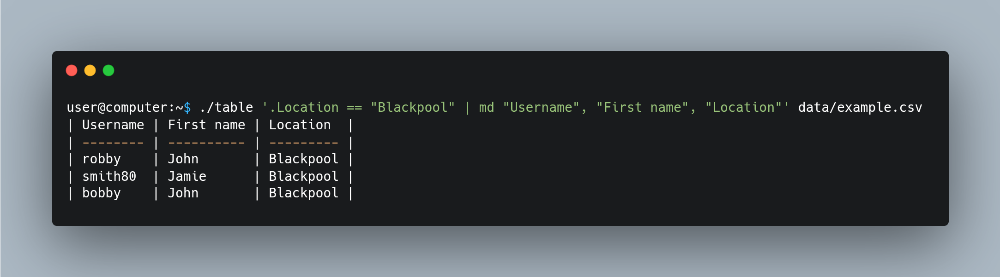

# table
Golang tool for performing table based filtering operations. Supports CSV, JSON and md tables.
This tool works similar to `jq`.
Where you pass a set of filters or queries to mutate the csv data or extract lines that interest you.

There are various output modifiers like:
 - csv
 - markdown table
 - JSON
 - JSON
 - HTML

Here is a simple usage of `table`:


You can select columns to compare to values by using:
 - `.<column name>`: Or for column names that contain spaces ->`."<column name>"`.
 - `$<column index>`: Similar to AWK.

Comparing numbers is also supported.

## Predefined variables
This project is heavily inspired by AWK (as all things that are good).
So here are some predefined variables you can utilize:
 - `NF`: Number of fields.
 - `FNR`: Current record/row number (This is zero indexed).
 - `NR`: Record/Row count.

## Install
Install using `go install`:
```
go install github.com/soerlemans/table@latest
```

Diclaimer: This project is not feature complete or production ready, bugs will arise.

## Help
```
Version: 0.1
Usage: table [--file FILE] [--stdin] [--field-separator FIELD-SEPARATOR] [--csv] [--json] [--excel] [PROGRAMTEXT [INPUTFILES [INPUTFILES ...]]]

Positional arguments:
  PROGRAMTEXT            Filter to execute.
  INPUTFILES             Files to source as input.

Options:
  --file FILE, -f FILE   Path to file containing filters.
  --stdin                Specifies if the program should read from stdin. [default: false]
  --field-separator FIELD-SEPARATOR, -F FIELD-SEPARATOR
                         Define the field separator.
  --csv                  Define that input is CSV (default).
  --json                 Define that input is JSON.
  --excel                Define that input is Excel.
  --help, -h             display this help and exit
```
